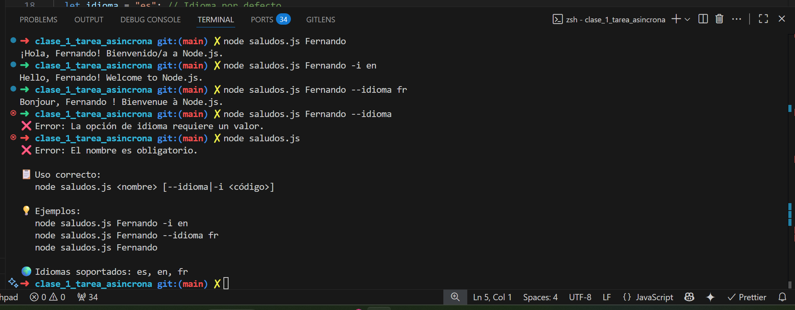

## Curso de INTEGRACION Back-end(basado en Node.js)

```text
Fernando López
Centro de Desarrollo Sostenible S.A
```

---

Clase 1.

[Ejercicio Guiado – Instalación y Primer Script en Node.js](https://github.com/ferpiecel/integracion-back-end-node2025/tree/main/clase_1)

```
- Duración estimada: 1 hora
- Objetivo: Instalar las herramientas necesarias y crear un programa básico
“Hello World” en Node.js.
- Herramientas: Navegador web + Visual Studio Code + (Terminal/Consola) + Node.js ya instalado.
```


---

[Tarea Asincrónica – Semana 1](https://github.com/ferpiecel/integracion-back-end-node2025/tree/main/clase_1_tarea_asincrona)

```
Crea un archivo llamado saludos.js en tu carpeta de proyecto.
2. El programa debe aceptar los siguientes argumentos por línea de comandos:
 Un nombre obligatorio.
 Una opción opcional --idioma o -i para elegir el idioma del saludo:
o "es" para español (por defecto).
o "en" para inglés.
o "fr" para francés.

```


